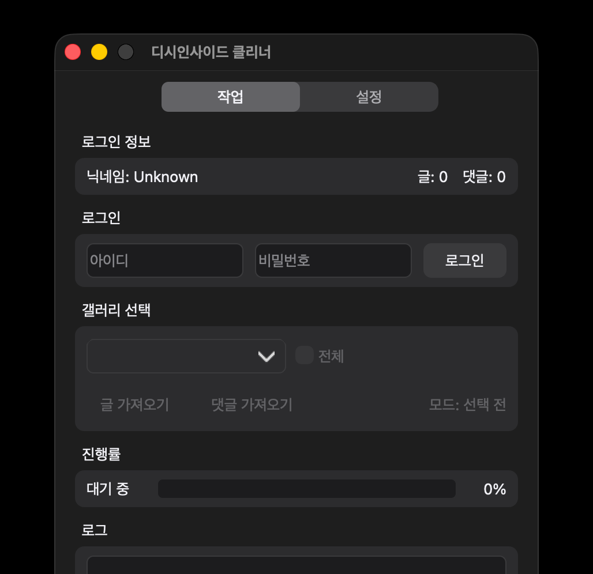

# DCInside Cleaner for macOS

<p align="center">
  
</p>

디시인사이드에 작성한 글과 댓글을 조회하고 정리하는 macOS용 GUI 포팅 버전입니다.

원작: [dlcjsdltlq/dcinside-cleaner](https://github.com/dlcjsdltlq/dcinside-cleaner)

## 기능

- 계정 로그인 및 작성 글·댓글 조회/삭제
- 작성글 삭제 전 차단 가능성을 한 번 안내하고, 동의한 작업의 추가 확인을 자동 처리
- 삭제 성공과 이미 없는 항목의 건너뜀을 구분하는 진행률·작업 로그
- 프록시 및 선택적 2Captcha 설정

작성글 삭제 동의는 해당 실행에만 적용되며, 댓글에는 이 경고가 표시되지 않습니다. 서버가 명시적으로 삭제 성공을 반환한 항목만 삭제 수에 반영합니다. 캡차 해제 중 브라우저에서 직접 지워진 항목은 건너뛰고 계속하며, 로그인·권한·통신 등 다른 오류는 작업을 중단합니다.

## 설치

[Releases](https://github.com/NowonWantsThis/DCinside-cleaner-macOS/releases)에서 최신 Apple Silicon용 ZIP을 내려받아 실행합니다.

0.2.0 ZIP의 앱 이름은 `DCInside Cleaner 0.2.0.app`이며, 기존 버전과 나란히 보관할 수 있습니다.

현재 테스트 배포 중인 비공증 빌드입니다. macOS가 실행을 차단하면 Finder에서 앱을 Control-클릭한 뒤 `열기`를 선택하세요.

## 직접 실행 및 빌드

```bash
python3 -m venv .venv
source .venv/bin/activate
python -m pip install -r requirements.txt pyinstaller
python execute.py
pyinstaller --noconfirm --clean build-macos.spec
```

실제 계정 접속·삭제 없이 오프라인 테스트를 실행하려면:

```bash
QT_QPA_PLATFORM=offscreen python -m unittest discover -s tests -v
```

변경 사항은 [변경 기록](CHANGELOG.md)을 확인하세요.

## 주의

삭제 작업은 되돌릴 수 없습니다. 실행 전 대상 갤러리와 작업 종류를 확인하세요. 계정 정보, 쿠키, API 키와 프록시 목록은 저장소에 포함하지 않습니다.

## 라이선스

[MIT License](LICENSE) · Original work copyright (c) 2020 dlcjsdltlq
